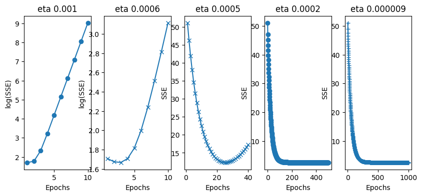
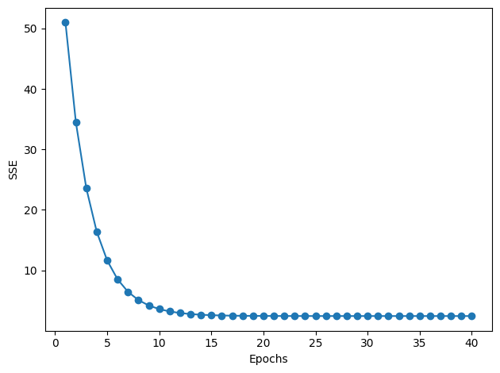
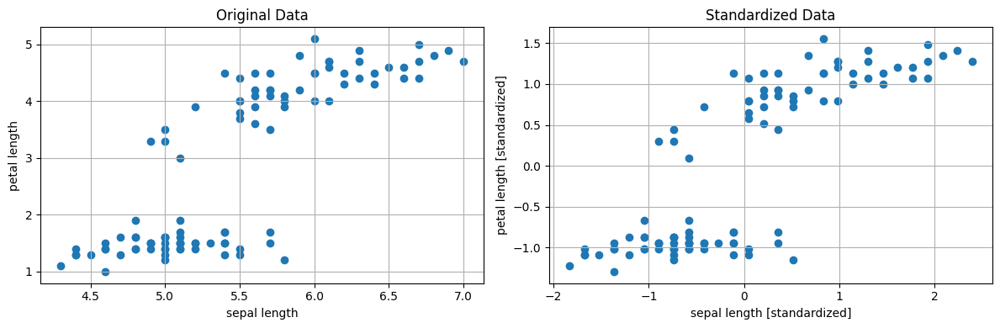
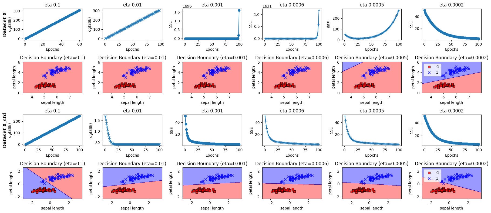

# [NN Series 4/n] Feature Normalisation

This is an interesting one as I'd thought it was uite academic. Then I saw these graphs

## Error per epoch 

This graph shows the error per epoch of training a model on the data as is



We can see that it takes around 180-200 epochs to train with a learning rate (eta) of 0.0002 or lower.

Then I saw this



Here we see the training takes around 15 epochs with a learning rate of 0.01.

Wow, normalisating the iris data had a significant impact on the training time. That over 10 times less epochs to converge.

## Understanding the change

This code plots the data before and after normalisation

```python
# standardize features

X_std = np.copy(X)
X_std[:, 0] = (X[:, 0] - X[:, 0].mean()) / X[:, 0].std()
X_std[:, 1] = (X[:, 1] - X[:, 1].mean()) / X[:, 1].std()


# Create a figure with two subplots side by side
fig, (ax1, ax2) = plt.subplots(1, 2, figsize=(12, 4))

# Plot original data
ax1.scatter(X[:, 0], X[:, 1])
ax1.set_title('Original Data')
ax1.set_xlabel('sepal length')
ax1.set_ylabel('petal length')

# Plot standardized data
ax2.scatter(X_std[:, 0], X_std[:, 1])
ax2.set_title('Standardized Data')
ax2.set_xlabel('sepal length [standardized]')
ax2.set_ylabel('petal length [standardized]')

# Add a grid for better visualization
ax1.grid(True)
ax2.grid(True)

# Adjust layout to prevent overlap
plt.tight_layout()

# Show the plot
plt.show()

# Optional: Print some statistics to understand the transformation
print("\nOriginal Data Statistics:")
print(f"Feature 1 - Mean: {X[:, 0].mean():.2f}, Std: {X[:, 0].std():.2f}")
print(f"Feature 2 - Mean: {X[:, 1].mean():.2f}, Std: {X[:, 1].std():.2f}")

print("\nStandardized Data Statistics:")
print(f"Feature 1 - Mean: {X_std[:, 0].mean():.2f}, Std: {X_std[:, 0].std():.2f}")
print(f"Feature 2 - Mean: {X_std[:, 1].mean():.2f}, Std: {X_std[:, 1].std():.2f}")
```

The following scatter graphs are produced, showing the data is relatively the same. 



## Full training comparison

To help me solidify the difference I wrote a function that runs the same training against two datasets, it's available here https://github.com/thompsonson/neuralnet-background/blob/main/feature_normalisation.ipynb 

This is the code to configure the data, learning rates, iterations and markers

```python
# Run the analysis
normalised_config = {
    "input_data": [X, X_std],  # Array of different datasets to try
    "learning_rates": [0.1, 0.01, 0.001, 0.0006, 0.0005, 0.0002],
    "n_iters": [100, 100, 100, 100, 100],
    "markers": ['o', 'x', 'o', '+', '+']
}


models = run_adaline_analysis(X_std, y, custom_config=normalised_config)
```

This is the output



## Conclusion

Data Normalisation, at least for the iris data, is simple to do with Numpy and has a signficiant improvement on training.

There appears to be a sweet spot on the learning rate - for this model is was ~0.01. Before and after that the results either do not converge or take increasingly longer to converge. I'm mildly curious to know if there's a sweet spot on the data as is, however I know I do not have time so that'll forever be unknown.... 

